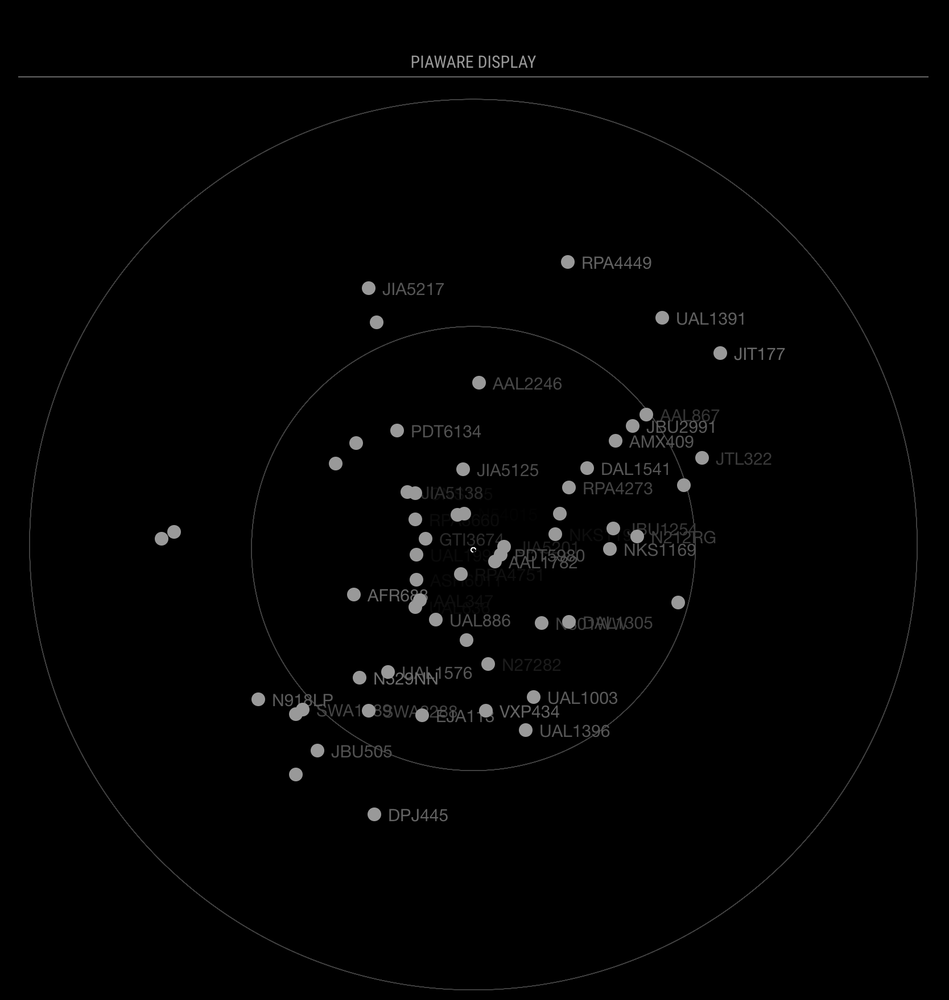

# MMM-PiAware

A module for the MagicMirror project to integrate a local network PiAware instance.



## Installation

```bash
cd ~/MagicMirror/modules
git clone https://github.com/The-Better-Aviator/MMM-PiAware
cd MMM-PiAware
npm install
```

Add the following to your `/config/config.js` file:

```js
    {
      module: 'MMM-PiAware',
      position: 'top_center',
      header: 'PiAware Display',
      config: {
        piAwareAddress: '[PIAWARE_IP_ADDRESS]:8080',
        // The following settings are optional, and depict the default values:
        showLocation: true,
        size: 500,
        targetSize: 10,
        rangeRings: [50, 100, 150, 200, 250, 300],
        showIdBlock: true,
        useFade: true,
        showAlt: false,
        showSpeed: false,
        lineFeatures: null,
      },
    },
```

## Config Options

| Option         | Required                                      | Type    | Description                                                                                                                                                                                                  |
| -------------- | --------------------------------------------- | ------- | ------------------------------------------------------------------------------------------------------------------------------------------------------------------------------------------------------------ |
| piAwareAddress | Yes                                           | String  | The IP Address of your local network PiAware instance (see [PiAware IP Address](#piaware-ip-address) for more detail).                                                                                       |
| showLocation   | No (Default: `true`)                          | Bool    | Adds a small circle at your feeder location on the map.                                                                                                                                                      |
| size           | No (Default: `500`)                           | Integer | The size of the map container in pixels. **NOTE:** MagicMirror sizes components depending on what else you have installed. You may have to play with this value and/or the range to get things looking nice. |
| targetSize     | No (Default: `10`)                            | Integer | The size of the target on the map in pixels.                                                                                                                                                                 |
| rangeRings     | No (Default: `[50, 100, 150, 200, 250, 300]`) | Array   | Adds a range ring at each integer value in the array. (see [Range Rings](#range-rings) for more detail)                                                                                                      |
| showIdBlock    | No (Default: `true`)                          | Bool    | Shows the aircraft identifier (flight/tail number), and allows the display of altitude and speed (options below).                                                                                            |
| useFade        | No (Default: `true`)                          | Bool    | Causes the ID Block to dim as the altitude decreases (as in example image).                                                                                                                                  |
| showAlt        | No (Default: `false`)                         | Bool    | Shows the aircraft altitude below the flight number.                                                                                                                                                         |
| showSpeed      | No (Default: `false`)                         | Bool    | Shows the aircraft speed below the flight number.                                                                                                                                                            |
| lineFeatures   | No (Default: `null`)                          | Array   | Array of objects used to draw lines on the map (see [Line Features](#line-features) for more detail).                                                                                                        |
| lat            | No (**Discouraged.** Default: `0.0`)          | Decimal | Overrides the auto-fetch of the PiAware receiver latitude with the value.                                                                                                                                    |
| lon            | No (**Discouraged.** Default: `0.0`)          | Decimal | Overrides the auto-fetch of the PiAware receiver longitude with the value.                                                                                                                                   |

### PiAware IP Address

The easiest method for finding your PiAware IP Address is to go to log in to FlightAware and go to your stats page (`https://flightaware.com/adsb/stats/user/]`). Look for the `Site Local IP` entry in the `SITE INFORMATION` area. Make sure you use `Site Local IP` and **not** the `Internet IP`. If you do not see the entry, ensure that you are logged in. Your username should be at the top left of the page if you are logged in.

You can test if you have the correct IP Address by entering that value into the address bar of a web browser. For example, if your IP Address is shown as `192.168.1.100`, enter `http://192.168.1.100:8080` in the address bar. If you are redirected to a map view of your PiAware data, you have the correct address.

### Range Rings

The Range Rings array serves a dual purpose:

1. Printing range rings on the map.
2. Setting the zoom level of the map.

After the range rings are drawn, the map will adjust the zoom level to fit the largest range ring into the view. If you are only concerned about the traffic within a few miles of your location, use smaller range values so that the zoom level is higher.

### Line Features

While the purpose of this is to draw runway lines on the map, it can be used to draw any line on the map. The line features array must be an array of objects with keys `start` and `end`, with objects as values for each of those keys, with keys `lat` and `lon`. As an example, this `lineFeatures` array will plot lines for the three runways at KDCA:

```js
lineFeatures: [
  {
    start: { lat: 38.861698, lon: -77.038772 },
    end: { lat: 38.841045, lon: -77.036687 },
  },
  {
    start: { lat: 38.86194, lon: -77.044071 },
    end: { lat: 38.850154, lon: -77.032544 },
  },
  {
    start: { lat: 38.854456, lon: -77.033333 },
    end: { lat: 38.842252, lon: -77.040773 },
  },
];
```
